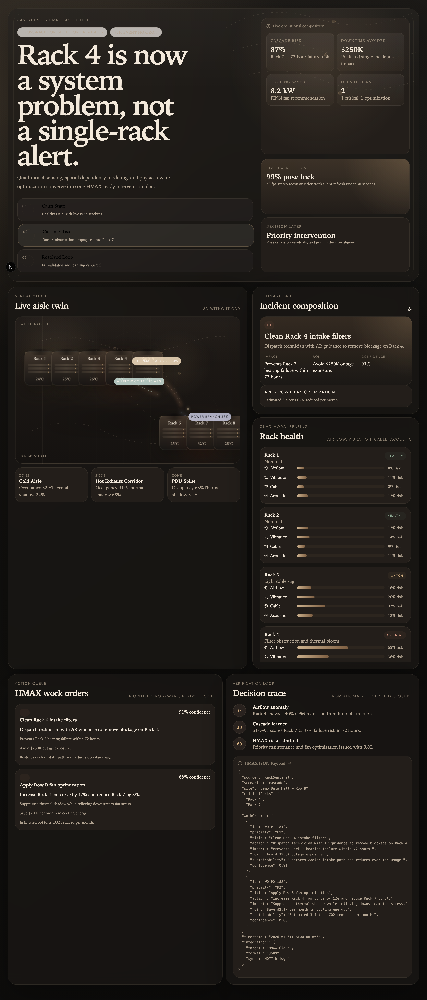
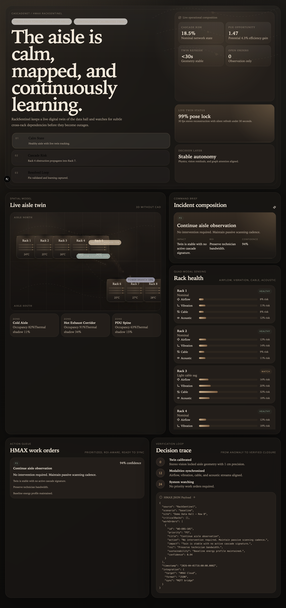
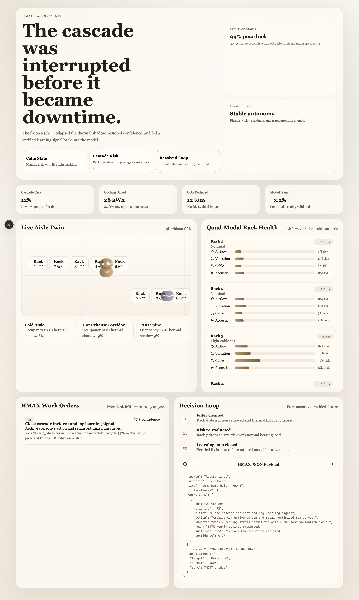

# CascadeNet

CascadeNet is a polished, hackathon-ready command center for predicting cross-rack cascading failures in data centers before they become downtime. It combines a live digital twin, multi-modal rack health sensing, dependency-aware risk propagation, and HMAX-style maintenance actions in one calm, minimal interface.

## Why it matters

Traditional monitoring tools alert on isolated symptoms. CascadeNet tells operators what fails next, why it fails, and which intervention prevents the cascade.

- Predicts rack-to-rack failure propagation instead of isolated alerts
- Frames the aisle as an interconnected thermal, airflow, and power system
- Converts detected risk into prioritized work orders with ROI and sustainability impact
- Demonstrates the full product story in a deterministic, judge-friendly prototype

## What the demo shows

- Live twin dashboard with luxury-minimal visual design
- Scenario switching across `Calm State`, `Cascade Risk`, and `Resolved Loop`
- Quad-modal health modeling across airflow, vibration, cable, and acoustic signals
- Spatial dependency edges showing how a single rack becomes a row-level risk
- HMAX-style JSON payload preview for enterprise workflow integration

## Screenshots

### Cascade risk



### Calm state



### Resolved loop



## Product narrative

In the demo scenario, Rack 4 develops an airflow obstruction. That localized issue changes thermal behavior across the aisle, increases fan stress on Rack 7, and drives a predicted bearing failure window within 72 hours. CascadeNet surfaces the chain of causality, recommends the fix, estimates avoided downtime, and validates the improvement once the issue is resolved.

## Tech stack

- Next.js 15
- React 19
- TypeScript
- App Router API routes
- Playwright for screenshot generation
- Python AI backend for CV, audio, SLAM, digital twin reconstruction, graph forecasting, and cooling optimization

## AI backend

The repo now includes a real backend scaffold in [`ai-backend/`](./ai-backend) for the concepts in the pitch:

- computer vision
- machine learning
- audio models
- SLAM
- digital twin reconstruction
- ST-GAT style graph prediction
- PINN-style cooling optimization

Run it with:

```bash
cd ai-backend
python3 -m venv .venv
source .venv/bin/activate
pip install -e .
python3 -m cascadenet_ai.run_demo
```

Architecture notes are in [`docs/AI_ARCHITECTURE.md`](./docs/AI_ARCHITECTURE.md).

## Run locally

```bash
npm install
npm run dev
```

Open [http://localhost:3000](http://localhost:3000).

## Generate screenshots

Run the app in one terminal:

```bash
npm run dev
```

Then in another terminal:

```bash
npm run capture:screenshots
```

Generated assets are written to `public/screenshots/`.

## Judge demo flow

The live pitch outline is in [`docs/DEMO_SCRIPT.md`](./docs/DEMO_SCRIPT.md).

Recommended sequence:

1. Start on `Cascade Risk`
2. Explain Rack 4 to Rack 7 propagation in the twin
3. Show the work orders and HMAX JSON payload
4. Switch to `Resolved Loop`
5. Close on avoided downtime, energy savings, and model learning

## Project structure

- `app/` routes, layout, global styles, API endpoints
- `components/` dashboard UI
- `lib/` seeded scenario data and simulation engine
- `ai-backend/` research backend for CV/ML/audio/graph/physics modules
- `docs/` judge-facing scripts and support material
- `scripts/` utility scripts such as screenshot capture

## Notes

The frontend prototype is intentionally deterministic so it remains reliable during judging, screen recording, and GitHub review. The new `ai-backend/` package is where the repo now carries the ML/CV/physics concepts as executable code without forcing heavy native runtime dependencies into the presentation layer.
